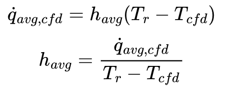
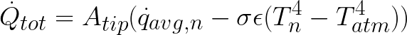
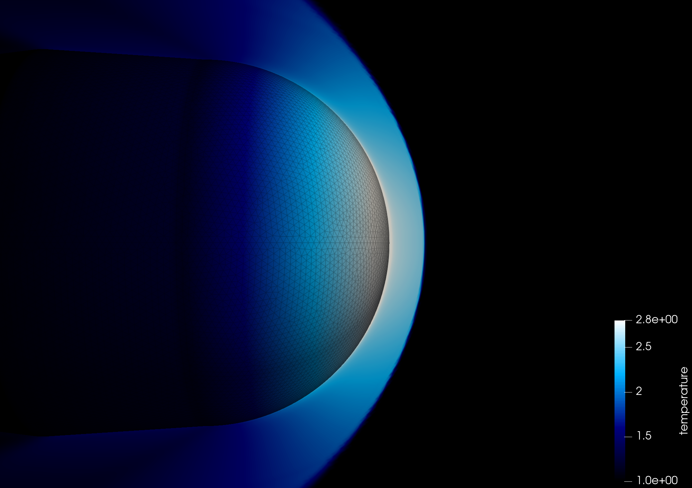

# Preamble

I wanted to hack this together to share some detail behind what I did for [meatrocket](https://www.youtube.com/bpsspace) temperature predictions, but also to maybe help defend+explain some of the really cursed things I did. 

**This is not the quickest/most-efficient way to get this answer. This was a nice real-world test case of some tools I have been developing to run CFD at home, for hobby uses, on my personal machine.**

Regardless- if you found your way here, I hope you find something in here interesting and/or insightful :)

# What are we trying to do here?
We are trying to predict the temperature of a lump of copper (nosecone tip), as it is being subjected to aero-thermal heating on a rocket flight trajectory. 

To solve the temperature question, we first need to know the aero-heating environment that the nosecone tip going to be subject to. 
When looking at heating on something like this- the first thing we turn to is our canonical, simple shapes/flows that are well studied. 
At the nosecone tip, you could get estimates for the stagnation point heating from a littany of sources (Van Driest, Detra, Tauber, Fay-Riddell). 
More downstream of the nosecone tip, we could use something like flat-plate boundary layer heating correlations. 
But we would have to bridge between these two regimes somehow to get the full picture. 

Anyways, I didn't do any of that, and instead just ran some really (computationally) expensive Computational Fluid Dynamics (CFD) to determine the severity of the aero-heating applied to the nosecone. 
(*though I did use the above methods to sanity check my results*)

# CF(D:)
## Background
I am going to assume the reader has a little bit of familiarity with fluid mechanics and CFD for the rest of this... the results are below though if you want to skip the nerd talk.

Running this sort of high-speed, viscous CFD requires a specific type of mesh to capture the physics happening far away from the body, as well as the aero-heating/shearing that is 
happening *really* close to the body (within the "boundary layer"). We typically use an "extruded" mesh to capture the near-body/boundary-layer stuff, and a tetrahedral 
(in the simplest case) mesh to capture the far-field stuff. This ends up looking something like this, where the more-aligned triangles are the body surface mesh, the small rectangles are the 
extruded boundary layer volume mesh, and the less-aligned triangles are actually tetrahedra forming the far-field volume mesh:

As I am running this at home, on my personal machine, for "fun", I don't have the really nice+expensive software to make such meshes easily. 

What I do have though, is [GMSH](https://gmsh.info/), [NASA mesh_tools](https://software.nasa.gov/software/MSC-26648-1), vscode, and a dream. If you combine those together, 
you get [cfd_meshman](https://github.com/elliottmckee/cfd-meshman) - a completely free tool that can make these sorts of hybrid boundary-layer + 
far-field meshes, that are useful for running the type of CFD you'd want for this sort of thing. It is what I used to make the above image.

I will post in more detail about that workflow at some point. If interested, follow me on [Twitter/X](https://twitter.com/mckee_elliott).

There are a lot of limitations with this tool-chain right now though. The main one here being that I cannot make 2D meshes nor utilize symmetry planes to take 
advantage of the axi-symmetry of the nosecone tip. **So I am simulating this in full 3D, which is a tremendous waste of time and computational resources.**

## Geometry
Thankfully though, we only have to simulate a small section of the nosecone tip, and not the full rocket.

Super-sonic flows (which is the regime of interest, as it is where aero-heating occurs) have a very nice property, in that information can generally only travel downstream*. In other words, what is happening further
down on the rocket (for example, more near the nosecone shoulder or body), has no impact on the flow near the tip. (*the caveat here being that information can travel upstream within the **subsonic** 
boundary layer near the body)

Anyways, I ended up simulating something like this:

This looks pretty whacky... but I can explain...

I would do this way differently if I had a more-competent meshing software, but basically- I didn't want to chop the geometry right at the aft/base of the tip (red line), 
as that would cause a really big separation/wake in the immediate vicinity of a region I do care about. So I added a bit of an aft-body, and gave it a gradual taper so we aren't grossly separating 
the flow until reasonably far downstream of the nosecone tip that we actually care about- and when we do, we are doing so more gradually, due to the large aft-radius, 
which causes less computational shenanigans within the CFD solver (really strong/sharp angle changes like this, without adequete mesh resolution, can lead to instabilities).

## Mesh
Using the aformentioned [cfd_meshman](https://github.com/elliottmckee/cfd-meshman). I generated this:

**You do not have to tell me this is NOT a "good" mesh**- i know. It is a chiefly a product of the limitations of my $free.99 meshing software, and trying to use it to ham-fistedly capture physics I want.

The thin rectangular-looking cells (which are actually prisms in 3D) get extrodinarily thin near the surface. You need these really thin cells near the surface to resolve the sharp gradients of temperature in 
the boundary layer near the surface (*for those of us in the biz*, this is often more restrictive than the y+<1 criteria often used for resolving momentum components of turbulent boundary layers), 
and accurately predict heating.

Additionally, you want to have high resolution in the vicinity of shocks- and you ideally want these cells to be "aligned" with the shock (i.e. cell faces line up with the shock). 
If you have a really large cell that is not aligned with, and spans "over" a shock, it will serve to non-physically smear the shock out, and in the process, make it act less like a true "shock". 
The extruded mesh shown here isn't perfect for this purpose, as it is aligned to the body, not the shock, but it is certainly better than the tetrahedra, which have random relative orientations and are generally much larger.

So, in light of the 2x considerations above, and for lack of better options/judgement, I simply extruded my boundary layer mesh far out enough that it captured most of the shock that I cared about with adequate
resolution, and then just kinda blew out the resolution when we switch to the tetrahedral far field. This sort of cell-volume jump is normally sub-optimal- but I kinda needed to do it to keep the overall cell count down.

My final mesh had 3.1 million prisms, and 800k tetrahedra.

Here's an example showing the shock "captured" within this extruded boundary layer mesh.

I tried to go a bit further than needed, as I didn't know how far off the shock would "stand-off" from the nose, and to help have more resolution near the top and bottom of the above picture,
to help resolve the shock further away from the stagnation point, when it becomes less "normal". But if you look at the shock at the top and bottom of this image, you can see how the cells are 
no longer aligned with it, and it is serving to smear the shock out a bit, non-physically.

There are smarter ways to do this (assuming you have the proper tools/knowledge), which normally involve using a thinner extruded mesh to just capture the boundary layer, and then either 
"fitting" the mesh to the shock after you solve on an initial mesh (*which NASA mesh_tools can do*), or adapting your mesh during the solution to dynamically add resolution about the shock where needed.

## Conditions/Trajectory
Now that we have a mesh- we need to know what conditions to simulate. 

We have an expected trajectory (from something like OpenRocket, or RASAeroII), and we want to run CFD at a minimal number of points (to save on computation time), such that we resolve the heating pulse that we're 
gonna see in flight. 

You could just run at bunch of different mach numbers, but I am a big ole nerd, so I spaced my simulation conditions out by calculating the Chapman heating*, finding the peak, and then grabbing equal-heating 
increments on either side of that peak, as shown. (*this is a coarse approximation for stagnation point heating generally used in the context of planetary re-entry... somewhat of a heuristic really. But I think using turbulent flat plate heating would 
have been a better choice for the current work)

I also assumed standard atmosphere conditions at each altitude for all these runs.

## Post-processing
I am going to skip most of the CFD-solver/setup specific shenanigans. Partially because I believe in you, but mostly because this has taken way longer to write than expected. 
Feel free to reach out to me with questions on one of my linked socials if you are interested.

But I ran these simulations with "cold-wall" boundary conditions. As in, the temperature of the nosecone tip was always 300 Kelvin in the sims. This will come up later. 
I also ran everything assuming fully turbulent (even though length is short, Reynolds number is pretty high from the combo of high mach @ low altitude).  

In Paraview, I surface-area-weighted-averaged the heating across the actual tip (not including aft-body), to get the following average heating at each of the mach points I simulated, to get something like:

|mach	|qdot avg watts/m^2|
| -------- | ------- |
|0	    |0|
|0.634	|2714|
|1.503	|20188|
|1.883	|40474|
|2.16	|60704|
|2.387	|80637|
|2.583	|100427|
|2.787	|120160|
|2.66	|99788|
|2.493	|79325|
|2.293	|58704|
|2.038	|37660|
|1.674	|16646|
|0.788	|-2866|

The last point is negative, because the atmosphere at this point is actually cooler than 300K, which was the assumed wall temperature in sim.

 

# Temperature Predictions

Ok, that was a lot of work to just get some heating **environments**. How are we translate this into knowing how hot it actually gets?

Answer: MCEN 3012 - Thermodynamics 1

We assume the nosecone tip is a lumped mass. It has some thermal mass (m*Cp). Q = mCp∆T will set you free.

By taking the derivative of Q = mCp∆T, assuming a finite time step, and re-arranging, we arrive at something we can use in a forward-euler integration 

* T_n+1 is the temperature at the next time step
* T_n is the temperature at the current time step
* mCp is the thermal mass of the nosecone tip
* ∆t is some small time step
* Qdot_tot is your total heat flux [Watts] into the nosecone tip

We can then take this, given an initial temperature, and step forward in time to solve for the temperature along the trajectory. 

But unfortunately, Qdot_tot needs a bit more explaining. 

You could, as a simple cut, just take the "qdot avg" from the previous table, multiply it by the surface area of the tip, and just jam it in. 
But to be a bit more accurate, you'd want to perform an extra step of turning it into a heat-transfer coefficient. 
Remember how we ran the CFD simulations as a 300 Kelvin "cold-wall"? Doing this step basically allows us to compensate for the fact that the copper tip will heat up during flight, 
causing us to shlorp less heat in from our environment (since heat transfer is proportional to the temperature gradient). This also allows us to properly model the aero-cooling 
that will happen as you slow back down and the atmosphere becomes colder w/ altitude, relative to the hot copper tip.

I calculated the heat transfer coefficient, h from the above table data using:

* q_avg,cfd is the avg heating from cfd
* Tr is the [recovery temperature](https://www.thermopedia.com/content/291/) of the flow 
* T_cfd is 300K (from the CFD sim setup)

We can now sub in our solved-for temperature (Tn) as we step along the trajectory, to get the heating at a given timestep using:

I'm short on time, but additionally, you may want to consider the heat coming out of the nosecone tip via [radiation](https://en.wikipedia.org/wiki/Stefan%E2%80%93Boltzmann_law). 

And you also need to multiply this all by the surface area of the nosecone tip. Here's the final equation, roughly:

* A_tip is the tip external surface area
* qdot_avg_n is the average convective heating at time step n
* sigma and epsilon are the stefan-boltzman constant, and surface emissivity
* T_n is the tip temperature at time step n
* T_atm is the atmospheric temperature at time step n (using as a coarse approximation for radiation sink temperature)

# Results
I am so over-time on how long I thought this would take to write, so kinda just gonna drop the results here. 

## Pre-flight
I assumed a hot Mojave afternoon initial condition.

## Post-flight
The same as above, except I changed the initial condition of the simulation to match the Thermocouple initial temperature.

We captured the increase and peak temperature suprisingly well, but we are cooling off faster in model than in flight, which is interesting. I would've expected the opposite, as there is a bunch
of mass around the nosecone tip that I am not accounting for (the meat itself, the metal below it, the rest of the structure). Maybe the atmosphere was warmer relative to the STDATM I was assuming,
leading to less aero-cooling. I also didn't correct this for the actual, as-flown profile. 

I do want to call out that one of the larger assumptions I made throughout is that the flow is 100% turbulent over the entirety of the nosecone tip throughout flight. 
I think this is certainly closer to reality than assuming laminar (given high high mach+low altitude, and irl there is a screw in the tip itself which will disturb the flow a bit), 
but it is certainly possible that this is compensating for error elsewhere (like in the CFD-derived heatrates). But it also may help explain why we cool off faster, later on in flight, in our model. 
At those points, the velocity and density (and thus, Reynolds number) are way lower, so it is possible we are promoting a more laminar flow over the nosecone, which would serve to reduce heat transfer, 
which is not captured in this modeling.

## Epilogue
If you got here, thank you very much for reading, and I hope you found it somewhat worth your time. 

Feel free to reach out with questions if you've got 'em.

Oh, and support your local/[former](https://cusrl.com/) student groups/teams, be it rocketry or otherwise.

:)

