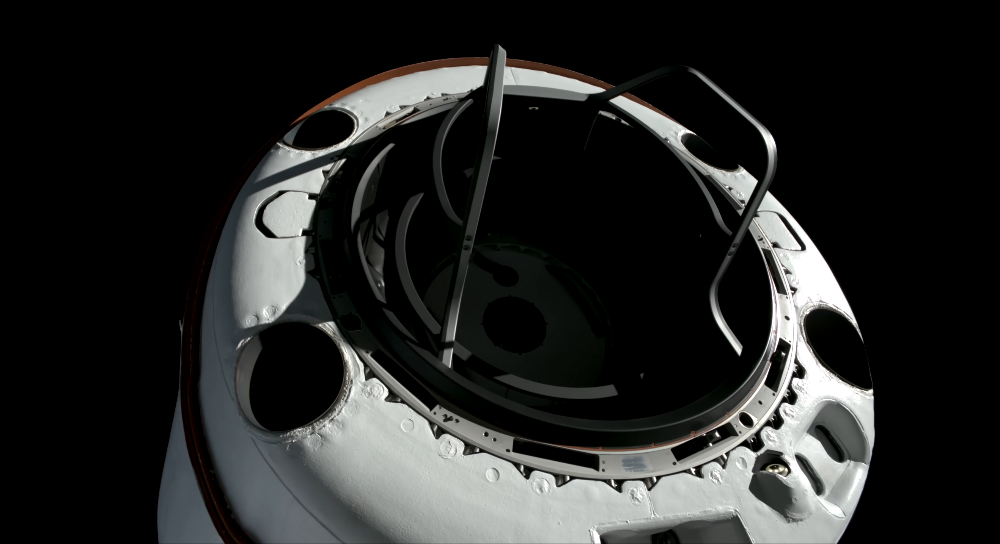
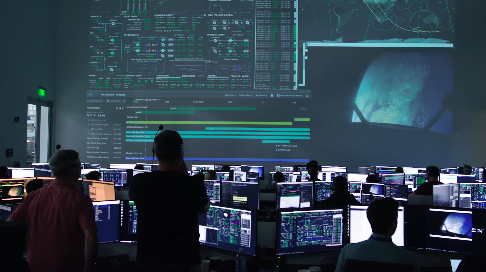

_Credit: Polaris Program / JOHN KRAUS (https://www.flickr.com/photos/polarisprogramphotos/53986597714/)_

# Preamble
I am sad it has taken me as long as it has to get around to writing this, for fear of dulling, blunting this attack/signal.

_Pacing, Enveloping, Humanity, Contrast, Reverance_

Mission Media:
  - https://youtu.be/MaJmUUtr2SI
  - https://www.flickr.com/photos/polarisprogramphotos/with/53973130404
  - https://www.johnkrausphotos.com/Galleries/Launches/Falcon-9-Polaris-Dawn

 

Launched: 9/10/2024 -- Written: 10/31/2024 -- Published: 12/10/2025

# Intro -> Nosecone Deploy

Taking a note from Sir Niles Rumfoord [^1], I think there is something about contrast, in the context of human spaceflight. The fast and the slow, the exciting and the serene, the danger and the life-affirmity, the lightness and darkness, the mechanicality and the humanity, the resilience and the fragility, the arcane, the collective. Seriousness and candor. Austere and elaborate?

As for my involvement here- I would describe it as a footnote at best- certainly nothing outstanding, keystone, pivotal, or critical.  I have bore witness to the work of those whose efforts can truly be described as such- whose relentless, innate, personal drive/fury/passion made this happen, I cannot claim to be part of this cadre, but I take immense pride in working alongside, and supporting the likes of such. 

The night of, I was not expecting to wake up and support throwing people into orbit. Just keep doing the “punt launch a few days, hope weather looks better,” ya know? But during breakfast, realizing that graveyard-shift support was probably not going to treat my usual sleep schedule kindly, I went back to bed, just in case. _Thanks Jared, for the few extra hours_. At `good_morning_2` (sometime between 1-3pm), we were on.

I am just a dumb analyst- so while I can't claim that people fly on something that I physically sculpted/brought into existence- there are maybe some numbers floating around in the aether that the voyagers rely upon to varying degrees- and while this is certainly less flashy+tangible, it is certainly still more than just cause for paranoia.

Experientially, among the usual (_+some unusual_) chaos: us nerds are just backroom support- so we get our own watered-down launch-day experience-  triple checking any mission-specific work we've done across our team over the past however many months, making references, checking decision/action trees, printing out said references+action-trees on one billion sheets of paper for redundancy, setting up monitoring, unofficial thermal-nerd GO/NOGO poll, ops+weather chatter/uncertainty on the nets, T0 push, official control room go-poll, countdown, launch, away.

Don't remember launch- Trunksep was stunning though. Separation, Plaser (_hateful machine_) reveal, ice/vapor glimmering in the sun, before it itself steps out in reveal from behind the ship. The lazy, serene drifting of two spacecraft in close proximity, as close as they would ever be again, over an immensely beautiful, rotating earth straked with clouds that looked of packed snow- the piercing point of the sun and its more diffuse doppleganger reflected off the earth, contrasted against the excitement and dynamism of launch itself, and the sense of relief following. The beautiful, subtle choreography of thruster blips in every direction. The gravitas, altitude, and scale becoming more and more apparent as spacecraft and passengers coast further away. Nosecone deploy footage was ripped straight out of an IMAX documentary- glimpses of the crew through the forward hatch window as it actuates, exposure reeling to adjust to the pure white of thermal control paint being bathed in unfiltered orbital light for the first time. 

_Credit: Space Exploration Technologies Corp. (https://youtu.be/MaJmUUtr2SI)_

# Graveyard Shift

Again, I was/am just a thermal nerd working backroom night/graveyard shift. That isn't to say I didn't have company, but it still afforded a certain serenity, and surplus room for thought/contemplation. Most of my time was spent watching lines (_thermal telemetry_) not do anything particularly exciting (_good_), to the arrhythmic tune of mission control chatter, hails, requests amongst earthlings sitting a few hundred feet behind me, and the current vanguard of our species' advance into that howling dark.  

Mission control always asks the astronauts if they can “come aboard” before patching into internal cameras. I personally choose to think that Dragon yields the same sort of permission/privilege, but for the external cams (_this is of course, in reality, just driven by ground station coverage_). Several days of watching lines on a screen not do much of anything, while being interrupted semi-regularly when the video stream would pick back up again- Dragon reaching out as if to say  “hey, check out this scene of unfathomable beauty I would like to share with you.” Views of powdered clouds over nothing but flat blue. Back to black. A crest of blue, rescinding in to orange, rescinding into black. You poke the guy behind you (Peter), elbow deep in a man-made-horror of a matlab script at 2AM, and watch in silence until the stream cuts. Nothing. We're back - and its some unidentifiable land mass (I really need to play more Worldle)- check the 3D view- “ah, Spain." 

There's something immersive [_not the right word but best i've got -  trance-inciting, magical, captivating_] about the pacing of it all, once on orbit. Similar to that of that of watching clouds from the ground. You can be staring at them the entire time, and there's nothing jumping out as identifiably changing moment-to-moment; but look away for a few, and everything does. Its very human-paced, despite everything else being anything but natural.

There's also something remarkably beautiful about seeing humans in space in an "unscripted" context. Like, they're just kinda hanging out up there (_they were certainly not “just hanging out,” as they were exceptionally busy with research, playing music, meals, sleeping, etc._). The scenes onboard during the relative lulls though were somewhat akin to when a family is bunkered up in their row on a long flight… but in zero-g… and with a bit more space. Someone's up in the attic, someone's in a seat, someone's on the floor, using the area below the seats as somewhat analagous to a desk, someone's doing frontflips for research. - everything actively being used either tucked cleverly into some nook/cranny, or tactically floating about the cabin to be retrieved/recentered at recurring intervals. Good morning calls to Dragon up from Mission Control- where it takes a few calls before a groggy astronaut picks up on the other side of the atmosphere. And again, something about the pacing of it all...

Ground-side - the unyielding, relentless commitment to efficiency, clarity, concision, and straightforwardness of information flow and decision during operations is a sound to behold. It carries with it a similar beauty as the most impressive technical apparatus- yet is doubtlessly human- being composed of people you have had otherwise completely normal/mundane conversations/relationships with- just operating in a fundamentally different, and somewhat unnatural (_in a good way_) mode. This capacity for immense collective focus/efficiency, juxtaposed against the occasional joke/jest that makes its way over the nets (_while remaining in mission-control-speak_) during the relative lulls, makes the entire procession that much more inexorably human.

_Credit: Space Exploration Technologies Corp. (https://youtu.be/MaJmUUtr2SI)_

# EVA + after

I think I internalized about one minute of the eva live, as the previously dormant lines understandably got a bit more dynamic. Despite the frantic ingestion of any and all information within reach, blistering chatter (comms, between teammates, backroom chats, etc.), I don't think anything could've drawn one away from the views of Jared ascending out of the hatch. You couldn't have scripted it better. Live first-person views watching space-suited hands climbing rungs (_unabashedly symbolic, if it were scripted_), out over a cresting lens/window into the immensely beautiful world below… But alas, the lines were speaking, and I had to go listen.

The falling action post-eva was much more calm, and gave yet another good chance to take inventory. 

The day after, waking up, walking out to my car, being stopped in the middle of the street by the purple LA sky setting over the watertower- sent this to some close friends: “watching the beautiful network cam streams from this tiny little spacecraft whipping around this planet, live-streamed helmet cam footage of humans climbing out of the hatch and looking down at this place- just, man- this place is f****** beautiful.”

_Credit: me, shot on my dusty iphone 8 TM_

The celebration afterwards was wonderful. Its funny with these sorts of things - since you of course can't forecast that there _will_ be a celebration - but still funny how they materialize. And once again, this came imbued throughout with unrelenting humanity. In celebration of the new Dry Tortugas splashdown site, there were many a inflatable turtle, and ~ten trillion squeaky rubber-duck adjacent turtles that initially played lead, then backup on the ambient soundscape. A keyboard came out of somewhere(???), and a manager started riffing "Piano Man", ham-fistedly interjected with space/polaris-related lyricism.

It was wonderful to be in such special company, during such a special moment in time, celebrating such a special, monumental collective effort. Almost as wonderful as knowing that on monday there wouldn't be any more Polaris Dawn related work to crunch. 

# Listless ramblings/ruminations of a human in awe

The confluence of immense physical, technical and human beauty I have witnessed this week is like nothing else I have ever experienced- an unimaginable coalescence of technical, physical, and human beauty that cannot be condensed, distilled, repackaged, or conveyed (_despite my feeble attempt here_).

I wouldn't claim to have experienced the overview- but I'd like to think I but glanced but a microcosm of it. If nothing else, its been nothing short of transformative regardless. Its not just a “seeing life in more vivid color" sort of thing... i'd describe it more as looking out at the world with a wider field of view - allowing the periphery more attention. Or to ham-fistedly misappropriate photography terms, like shifting conscience/focus from subject to composition... an appreciation not only for the beauty you have witnessed, but an appreciation of the fact that you are immersed within it. Beauty that is not only observed, but envelops. It is rare that we get a chance to peek our heads out of the trenches/tunnel-vision and appreciate it- but it sure looks pretty perfect from up there when you get to. 

And its not just you, its not just your school, its not just your parents, family, friends, acquaintances, twitter followers, dice rolls, but everything around you, and everything that came before to help put each of these things in place throughout an impressive time scale of things, which has culminated thusly- to give a small percentage of the population the opportunity to work on these sorts of things. To be a part of it _at all_, is such an immense privledge, honor, and purpose. To those who made this happen, I can't thank you enough.

To Mom, Dad, Emerson, Grace, Mags -- Cam, Paul, Kenny, Zoe, Zach, Anna, Owen, Quinton, Jack, Calvin, Teddy -- my current boss who I blew off initially but who vouched for me when I came crawling back -- my high school calc teacher that I blatantly lied to in an attempt to get extra credit, and so many more, thank you. 

_It takes an army._ 

-Elliott McKee

_Credit: Polaris Program / JOHN KRAUS https://www.flickr.com/photos/polarisprogramphotos/53996064941/in/photostream/_

# Footnotes
[^1]: “Its the _contrast_ they like. The order of events doesn't make any difference to them. Its the thrill of the _fast reverse_-” - Sirens of Titan, Vonnegut, Ch. 10

